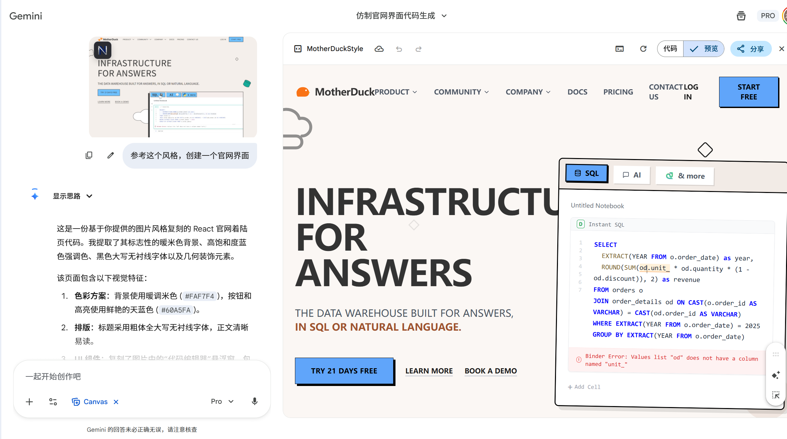
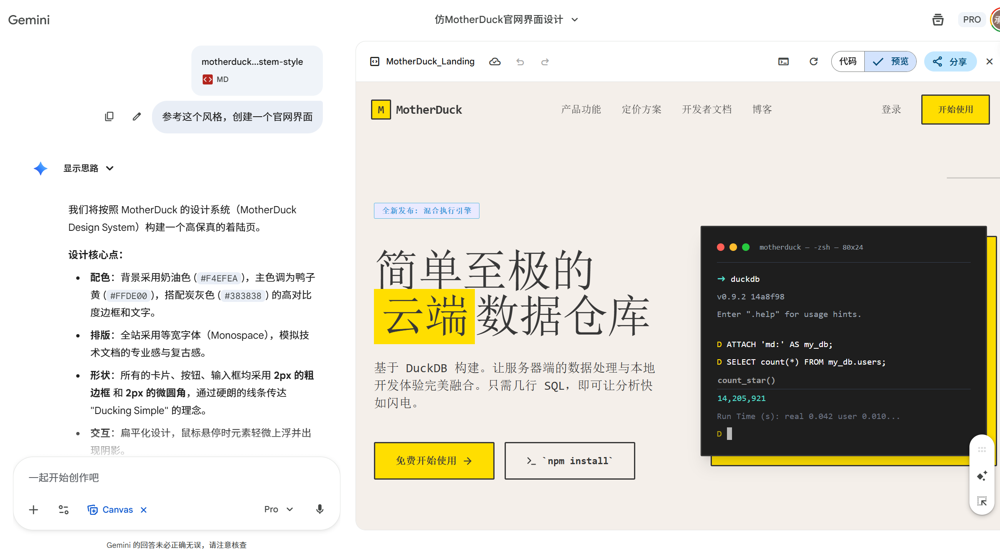

# style-extractor

从真实网页中提取颜色/字体/间距/组件/状态矩阵，并在网站存在动态效果时，补全运行时动效证据（timing、easing、keyframes、delay chain、JS 驱动动效线索）。

输出为风格指南（Markdown），可选生成 HTML 原型。

## 效果展示

| 仅图片风格参考 | 使用 Skill 生成文档后参考 |
|:--:|:--:|
|  |  |
|  |  |

## 目录结构

```
style-extractor/
├── SKILL.md              # Skill 定义文件（核心）
├── references/           # 参考样例（质量基准）
│   ├── endfield-design-system-style.md
│   └── motherduck-design-system-style.md
├── scripts/              # 辅助脚本
│   ├── extract-keyframes.py
│   ├── library-detect.js
│   └── motion-tools.js
└── image/                # README 图片
```

## 依赖

- Node.js（需要能运行 `npx`）
- Chrome（Stable）
- Codex CLI（或任何支持 MCP 的客户端）
- **必装：`chrome-devtools-mcp`（Chrome DevTools MCP）**：让 agent 能控制/检查真实 Chrome，抓网络请求、截图、运行脚本、录 trace 等

## 安装

### 1) 安装 Chrome DevTools MCP（`chrome-devtools-mcp`）

具体教程不列出

### 2) 安装本 Skill

1. 直接从仓库下载 zip（压缩包）
2. 解压并放到 Codex skills(claude code同理) 目录（推荐 `public`）下，例如：
   - `C:\\Users\\<You>\\.codex\\skills\\public\\style-extractor\\`
3. 确认该目录下能看到 `SKILL.md`、`references/`、`scripts/`

## 使用

### 1 在 Codex(cc) 里这样下指令

"帮我提取xx(网页链接)的风格"。
如果没有反应，可以尝试指定 style-extractor 这个 skill 名，客户端便会自己开始行动

（提示：`chrome-devtools-mcp` 通常会在首次调用需要浏览器的工具时自动启动/连接 Chrome。）

生成的内容就会在"C:\\Users\\<You>\\style-extractor"这个目录下。

## 参考与质量基准

- `references/endfield-design-system-style.md`：强动效证据写法（推荐优先对齐）
- `references/motherduck-design-system-style.md`：静态结构与表达方式参考

## 小提示（模型差异：经验之谈）

- 实测：**Codex 往往更"勤快"**，更愿意把动效证据抓全（例如 `document.getAnimations()`、采样、trace）。
- 实测：**Claude 往往审美更好**，但可能会"偷懒"跳过动效证据；建议你明确要求"必须输出动效证据 + keyframes + delay chain"，并让它按 `endfield` 参考格式交付。


## 下一步计划

- 增加对 JS 动画的适配